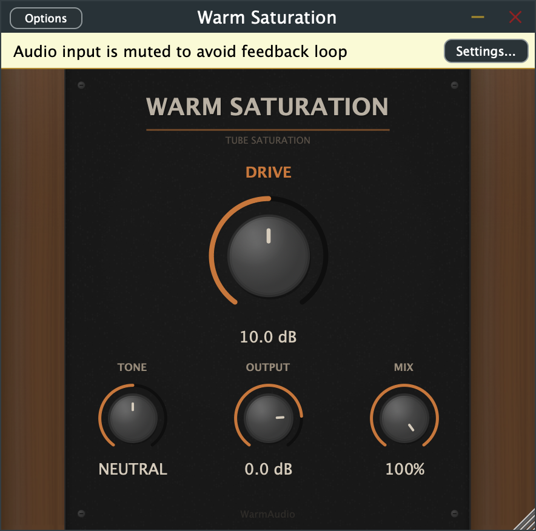

# Warm Saturation

A tube saturation VST3/AU plugin built with [JUCE](https://juce.com) — warm analog-style harmonic distortion with a physical hardware-inspired interface.



## Download

**[Latest Release](../../releases/latest)** — grab the DMG (macOS) or ZIP (Windows) from the Releases page.

| Platform | Formats | File |
|----------|---------|------|
| macOS (Universal) | VST3, AU, Standalone | `WarmSaturation-macOS.dmg` |
| Windows | VST3, Standalone | `WarmSaturation-Windows.zip` |

## Installation

### macOS

1. Open the DMG
2. Copy `Warm Saturation.vst3` to `~/Library/Audio/Plug-Ins/VST3/`
3. Copy `Warm Saturation.component` to `~/Library/Audio/Plug-Ins/Components/`
4. Rescan plugins in your DAW

> **Note:** The plugin is unsigned. On first launch macOS may block it — right-click the file and select **Open**, or go to **System Preferences > Privacy & Security** and click **Open Anyway**.

### Windows

1. Extract the ZIP
2. Copy the `Warm Saturation.vst3` folder to `C:\Program Files\Common Files\VST3\`
3. Rescan plugins in your DAW

## Features

- **Tube-style saturation** — asymmetric soft-clipping waveshaping generates even-order harmonics (2nd, 4th) for warm, musical distortion that sounds like real vacuum tubes
- **Tilt EQ tone control** — single-knob spectral shaping that pivots around 800Hz. Turn left for dark and warm, right for bright and present, center for neutral
- **Dry/wet mix** — parallel blend for subtle saturation textures without overwhelming the source
- **Physical hardware GUI** — dark walnut wood side panels with procedural grain, matte black powder-coated faceplate, brushed metal knobs with specular highlights, decorative corner screws
- **Resizable** — drag the bottom-right corner to resize (locked aspect ratio)

## Controls

| Knob | Range | Default | Description |
|------|-------|---------|-------------|
| **Drive** | 0 – 40 dB | 10 dB | Pushes the signal into the tube waveshaper. Higher values = more saturation and harmonic content |
| **Tone** | Dark ← Neutral → Bright | Neutral | Tilt EQ with ±6dB range around 800Hz. Shapes the overall spectral balance |
| **Output** | -24 to +6 dB | 0 dB | Post-saturation output level. Use to compensate for volume changes from the drive |
| **Mix** | 0 – 100% | 100% | Dry/wet blend. Lower values mix the clean signal back in for parallel saturation |

## Build from Source

Requires CMake 3.22+ and a C++17 compiler.

```bash
git clone --recursive https://github.com/Ben-Nachmanson/Saturation-Plugin.git
cd Saturation-Plugin
cmake -B build -DCMAKE_BUILD_TYPE=Release
cmake --build build --config Release
```

On macOS, plugins are automatically copied to the system plugin folders after building.

## DSP Design

The saturation uses an asymmetric transfer function that models vacuum tube behavior:

```
f(x) = tanh(x) + 0.15 * x^2 / (1 + |x|)
```

- `tanh(x)` provides smooth soft-clipping (odd harmonics)
- The `x^2` term is always positive regardless of input sign, creating **asymmetry** in the transfer curve
- This asymmetry generates **even-order harmonics** (2nd, 4th) — the signature warmth of tube circuits
- The `(1 + |x|)` denominator prevents the squared term from blowing up at high drive levels

The tone control is a first-order tilt shelf filter that shifts the spectral balance around an 800Hz pivot point, derived from a matched analog prototype via bilinear transform.

## License

This project uses the [JUCE framework](https://juce.com) which is available under the [AGPLv3 license](https://www.gnu.org/licenses/agpl-3.0.en.html) for open-source projects.
